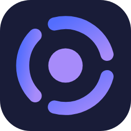
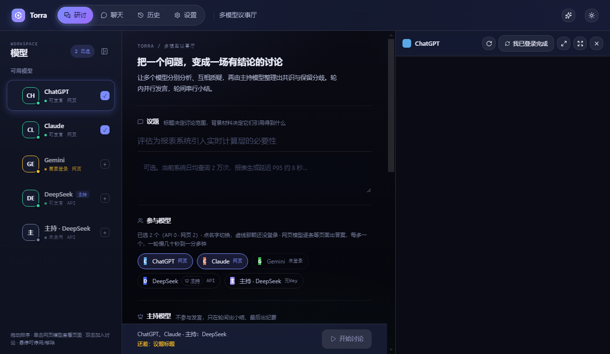
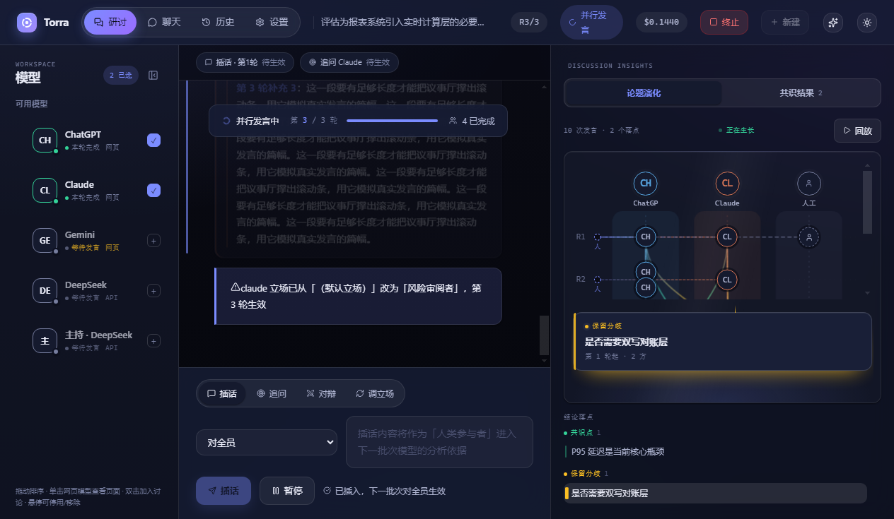
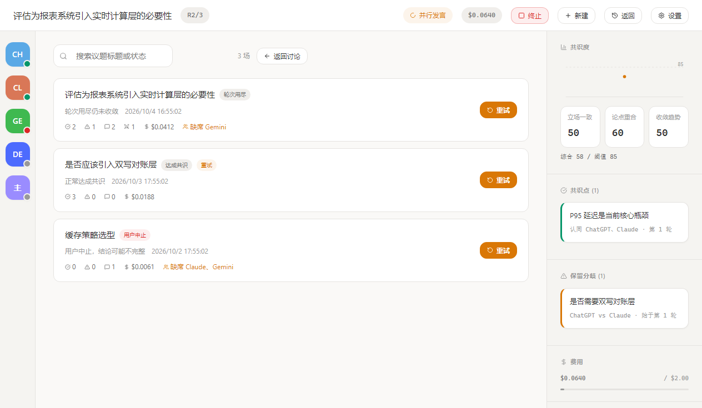

<p align="center">
  
</p>

<h1 align="center">Torra</h1>

<p align="center">
  多模型 AI 议事厅桌面客户端<br/>
  把「用户当传声筒」变成「模型开圆桌会」
</p>

<p align="center">
  <a href="https://github.com/Alleyf/Torra/actions/workflows/build.yml"></a>
  <a href="https://github.com/Alleyf/Torra/releases/latest"></a>
  <a href="https://github.com/Alleyf/Torra/releases"></a>
  
  <a href="LICENSE"></a>
</p>

---

## 初心

重度 AI 用户研究复杂问题时，往往要同时问 ChatGPT、Claude、Gemini、Kimi、DeepSeek——
然后发现自己变成了最累的那个人：

- **反复切换**：在 3~5 个网页标签间来回跳，心流被打断；
- **人工搬运**：手动把 A 的观点复制给 B，用户扮演传声筒；
- **信息过载**：N 个模型给你 N 份完整回答，共识和分歧还得自己提炼；
- **无法收敛**：模型之间从未真正对话、互相质疑，讨论深度受限于你的转述能力。

市面上的聚合工具解决了「一次问多家」，但没有解决「让它们互相听见」。
Torra 想做的是后者：你只提出议题，多个模型按轮次**并行发言、点名回应**，
主持模型逐轮整理共识与保留分歧，最后交给你一份**每条结论都能溯源到模型和轮次**的报告。

几条从第一天就定下的原则：

1. **分歧不被抹平**。未决分歧只增不减，消解必须给出依据；
   如果一份报告的「保留分歧」长期为空，说明产品退化成了表面附和的共识机——那是失败，不是成功。
2. **共识度是算出来的，不是模型说的**。立场一致度、论点重合度、收敛趋势三维全部由程序核算；
   主持声称的共识点若引用了不存在的发言，程序直接拒绝这次小结。
3. **你的订阅不浪费**。网页版通道复用你已有的会员（凭据只存本机、分区隔离），
   API 与网页双通道，谁可用走谁。
4. **人是一等公民**。插话、追问、对辩、调立场随时可介入，且介入内容单独注入、
   不参与共识度核算——人的表态不该被算成模型间的共识。

## 界面

<p align="center">
  <br/>
  <sub>发起一场讨论：左栏模型通道带真实可用性状态灯，右侧可直接唤起网页版</sub>
</p>

<p align="center">
  <br/>
  <sub>讨论进行中：插话/追问/对辩面板、论题演化图与结论台账并排呈现</sub>
</p>

<p align="center">
  <br/>
  <sub>发言卡标注模型、轮次与费用；共识度按三维度核算并展示可核验依据</sub>
</p>

## 它是怎么运转的

一轮 = 一个并行发言批次 + 一次主持小结。同批次模型看到的是同一份「上轮结束时的快照」，
互相看不到本轮发言，保证独立性；交叉质询由主持在下一轮发起。参与模型被分配互斥立场
（支持 / 反对 / 风险 / 务实 / 中立）以对抗同质化。默认 5 模型 × 3 轮 ≈ 6 个串行批次，
几分钟内拿到一份带共识、分歧与溯源的报告。

完整机制（批次模型、机械校验、缺席降级、重试语义、人工介入）见
[docs/ARCHITECTURE.md](docs/ARCHITECTURE.md) 与 [docs/FEATURES.md](docs/FEATURES.md)。

## 下载与安装

前往 [Releases](https://github.com/Alleyf/Torra/releases/latest) 下载：

| 文件 | 用途 |
| --- | --- |
| `Torra-Setup-x.y.z.exe` | 安装版：可选安装目录，创建桌面/开始菜单快捷方式 |
| `Torra-Portable-x.y.z.exe` | 便携版：双击即用，不写注册表 |

- 目前仅构建 **Windows x64**。
- 应用未做代码签名，首次运行 SmartScreen 会提示「未知发布者」，点「仍要打开」即可。
- 登录态与会话存在用户目录下的 torra 数据目录，卸载安装版不会清掉它。

## 第一次使用

1. 首次启动会展示**合规确认墙**：驱动网页版 LLM 可能触发平台风控，
   Torra 不提供任何规避验证码/风控的手段，检测到人机验证立即停下、引导你手动接管。
2. 在「发起讨论」页配置通道：API 型填 Key（仅存本机系统钥匙串，不上传）；
   网页型点左栏头像，**在 Torra 自己的登录窗口里登录**。
3. 网页登录态存在独立分区（`persist:torra-<model>`），与日常浏览器完全隔离——
   在 Chrome 里登录 ChatGPT 对 Torra 无效，这是「明明登录了却提示需要登录」最常见的原因。

## 开发

```bash
npm install        # 若报 esbuild / rollup 平台包缺失，见 docs/DEV.md「安装陷阱」
npm run dev        # vite + tsc watch + Electron，一条命令全起
npm run typecheck  # 主进程 + 渲染层类型检查
npm test           # 19 个自测脚本（不变量/编排/助手/凭据…）
npm run dist       # electron-builder 打 Windows 安装包
```

技术栈：Electron 33 + React 18 + TypeScript + Vite；渲染层 Zustand，主进程编排状态机。
新增站点适配器只需放一个 YAML 进 `adapters/`，热更新生效，不改主程序代码
（见 [docs/ADAPTERS.md](docs/ADAPTERS.md)）。

## 文档

| 文档 | 内容 |
| --- | --- |
| [docs/Torra-PRD.md](docs/Torra-PRD.md) | 产品需求文档：目标、场景、指标与红线 |
| [docs/ARCHITECTURE.md](docs/ARCHITECTURE.md) | 架构、关键设计与目录结构 |
| [docs/FEATURES.md](docs/FEATURES.md) | 人工介入与重试语义 |
| [docs/ADAPTERS.md](docs/ADAPTERS.md) | 站点适配器、登录态持久化、状态灯与排查 |
| [docs/DEV.md](docs/DEV.md) | 常用命令、安装陷阱与里程碑状态 |

## 合规与免责

- 网页版自动化通道尊重各站点服务条款：不绕过验证码与风控，不做任何伪装；
  接入新站点前请自行确认其条款对自动化访问的态度。
- API Key 与网页登录态只存本机（系统钥匙串 / 独立浏览器分区），Torra 不托管、不上传任何凭据。

## License

[MIT](LICENSE)
